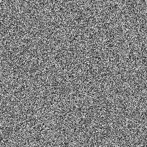

# Prando

[](https://www.npmjs.com/package/prando)
[](https://travis-ci.org/zeh/prando)
[](https://coveralls.io/github/zeh/prando?branch=master)
[](https://david-dm.org/zeh/prando)

Prando is a deterministic *pseudo-random number generator*. It can be used to create a series of random numbers that can later be re-created given the same seed.

Its goals are:

* Generate a random number sequence
* Reproducibility via a seed
* Fast generation

The counterpoint is that it is not trying to be [cryptographically secure](https://en.wikipedia.org/wiki/Cryptographically_secure_pseudorandom_number_generator).

Prando is created in TypeScript for extra code strength, but can be used both in JavaScript and TypeScript. The advantage of using it in TypeScript projects is that you get the benefit of code completion ("intellisense") by default.


## Motivation

Prando is better suited for games and user interfaces where randomness need to be taken into account deterministically.

For example, when creating React components for a Web page with random styles, one wouldn't want to use `Math.random()` during the `render()` call, as this would cause the element's style to change on every component update. Instead, by reusing a Prando random number generator, the same sequence of random numbers can be obtained when re-rendering a component.


## Algorithm

Prando current uses a xorshift for 32 bits based on [the triplet combination (13, 17, 5) by George Marsaglia](http://www.jstatsoft.org/v08/i14/paper). This combination produces a random sequence of period 2<sup>29</sup>-1, meaning it would take 536,870,912 iterations until the sequence repeats itself.

This can be seen in the noise map generated by calculating values in the 0..255 range for colors in a 300x300 image. No obvious patterns are visible:



Because of the algorithm's period length, it would actually require a noise image of at least 23,170px by 23,171px for the pattern to start repeating.

For a less visual but more accurate validation, see the module's [automated tests](https://travis-ci.org/zeh/prando).


## Installation

Install Prando as a module dependency using NPM:

```shell
npm install prando --save
```

Or using Yarn:

```shell
yarn add prando
```

## Usage

Import:

```javascript
// Import (JavaScript ES5)
var Prando = require('prando');

// Import (JavaScript ES6 and TypeScript)
import Prando from 'prando';
```

Create an instance:

```javascript
// Pseudo-random (time-based) seed
let rng = new Prando();

// Specific number seed
let rng = new Prando(123);

// Specific string (checksum-based) seed
let rng = new Prando("some-id");
```

Then, get a number using any of the `next()` functions. Example:

```javascript
// Between 0 (inclusive) and 1 (exclusive)
let num = rng.next();

// Between a min (inclusive) and a max (exclusive)
let num = rng.next(2, 10);

// Between an integer min (inclusive) and a max (inclusive)
let num = rng.nextInt(0, 100);
```


## Full reference

### `new Prando(seed:number|string = undefined):Prando`

Generate a new Prando pseudo-random number generator.

Parameters:

* `seed`: A number or string seed that determines which pseudo-random number sequence will be created. Defaults to a random seed based on `Math.random()`.

Return:

* A new `Prando` instance.


### `next(min:number = 0, pseudoMax:number = 1):number`

Generates a pseudo-random number between a lower (inclusive) and a higher (exclusive) bounds.

Parameters:

* `min`: The minimum number that can be randomly generated.
* `pseudoMax`: The maximum number that can be randomly generated (exclusive).

Returns:

* The generated pseudo-random number.


### `nextInt(min:number = 10, max:number = 100):number`

Generates a pseudo-random integer number in a range (inclusive).

Parameters:

* `min`: The minimum number that can be randomly generated.
* `max`: The maximum number that can be randomly generated.

Returns:

* The generated pseudo-random number.


### `nextString(length:number = 16, chars:string = "ABCDEFGHIJKLMNOPQRSTUVWXYZabcdefghijklmnopqrstuvwxyz0123456789"):string`

Generates a pseudo-random string sequence of a particular length from a specific character range.

Note: keep in mind that creating a random string sequence does not guarantee uniqueness; there is always a 1 in charLength<sup>stringLength</sup> chance of collision. For real unique string ids, always check for pre-existing ids, or employ a robust GUID/UUID generator.

* `length`: Length of the string to be generated.
* `chars`: Characters that are used when creating the random string. Defaults to all alphanumeric chars (A-Z, a-z, 0-9).

Returns:

* The generated string sequence.


### `nextChar(chars:string = "ABCDEFGHIJKLMNOPQRSTUVWXYZabcdefghijklmnopqrstuvwxyz0123456789"):string`

Generates a pseudo-random string of 1 character specific character range.

Parameters:

* `chars`: Characters that are used when creating the random string. Defaults to all alphanumeric chars (A-Z, a-z, 0-9).

Returns:

* The generated character.


### `nextArrayItem<T>(array:Array<T>):T`

Picks a pseudo-random item from an array. The array is left unmodified.

Note: keep in mind that while the returned item will be random enough, picking one item from the array at a time does not guarantee nor imply that a sequence of random non-repeating items will be picked. If you want to *pick items in a random order* from an array, instead of *picking one random item from an array*, it's best to apply a *shuffle* transformation to the array instead, then read it linearly.

Parameters:

* `array`: Array of any type containing one or more candidates for random picking.

Returns:

* An item from the array.


### `nextBoolean():boolean`

Generates a pseudo-random boolean.

Returns:

* A value of true or false.


### `reset():void`

Reset the pseudo-random number sequence back to its starting seed. Further calls to next() will then produce the same sequence of numbers it had produced before. This is equivalent to creating a new Prando instance with the same seed as another Prando instance.

Example:

```javascript
let rng = new Prando(12345678);
console.log(rng.next()); // 0.6177754114889017
console.log(rng.next()); // 0.5784605181725837
rng.reset();
console.log(rng.next()); // 0.6177754114889017 again
console.log(rng.next()); // 0.5784605181725837 again
```


### `skip(iterations:number = 1):void`

Skips ahead in the sequence of numbers that are being generated. This is equivalent to calling next() a specified number of times, but faster since it doesn't need to map the new random numbers to a range and return it.

Parameters:

* `iterations`: The number of items to skip ahead.


## License

[MIT](LICENSE.md).
